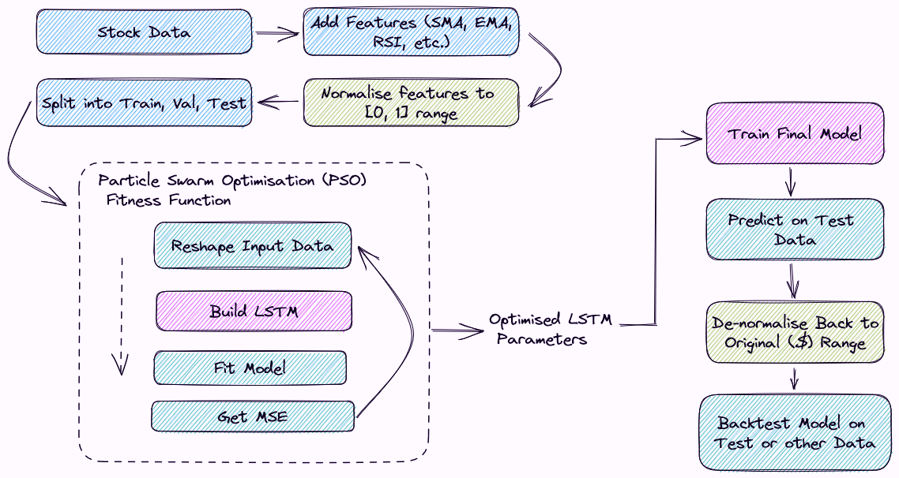

```{r, echo=FALSE, include=FALSE, eval=FALSE }
install.packages("keras")
```

```{r, include=FALSE}
library(pso)
library(ggplot2)
library(dplyr)
# library(tidyquant)
library(quantmod)
library(TTR)
library(tidyr)
library(keras)
library(tensorflow)
library(gridExtra)
```

# Price Prediction-Based Trading

Price Prediction-Based Trading is a strategy that utilises machine learning and statistical analysis to forecast future asset prices, aiming to identify market trends and potential reversals. Key aspects include using historical financial data, selecting suitable prediction models, preprocessing data through feature engineering, evaluating model performance, implementing risk management strategies, and continuously updating models to maintain accuracy. The use of historical financial data, the selection of appropriate prediction models, the preprocessing of data through feature engineering, the evaluation of model performance, the implementation of risk management strategies, and the continuous updating of models to maintain accuracy are all crucial elements. Although this method has the potential to enhance decision-making and market understanding, it is important to remember that price predictions inherently involve some degree of uncertainty and that no model can guarantee a 100% success rate.

**References:**
<https://www.simplilearn.com/tutorials/machine-learning-tutorial/stock-price-prediction-using-machine-learning>

<https://www.investopedia.com/articles/active-trading/110714/introduction-price-action-trading-strategies.asp>

```{r, include=FALSE, eval=FALSE}
tensorflow::install_tensorflow(version = "2.11.0", gpu = TRUE)
tf_config()
```

## Overview Diagram

```{r, out.width='70%', fig.align='center', echo=FALSE}

```
The above diagram is an overview of our PSO training process, including the preprocessing steps (explained below), PSO meta-optimisation, and final model training and inference.

## Technical Indicators as Features

### Simple Moving Average (SMA)

In the world of finance, the **Simple Moving Average (SMA)** is a common tool for examining stock prices and trading volume over time. In a nutshell, SMA "moves" along the time series by averaging a predetermined amount of data points inside a predetermined time interval. The goal is to eliminate noise caused by temporary variations so that the true trends become apparent. Simple moving averages (SMAs) are used by traders to track the long-term trend of a stock or other investments without being distracted by short-term fluctuations. This enables investors to evaluate longer-term and medium-term trends side by side. The price of an asset's bullish or bearish trend may be predicted with the use of a SMA. The market is considered to be in an uptrend if the SMA is moving higher, and a downtrend if the SMA is moving downward. **Reference:** <https://www.investopedia.com/terms/s/sma.asp>


### Exponential Moving Average (EMA)

For analysing financial time series data, such as stock prices, the **Exponential Moving Average (EMA)** is a popular technical indicator. EMA is a type of moving average that assigns more weight to recent data points, making it more responsive to price changes compared to the Simple Moving Average (SMA). EMA is more suited for spotting variations in trends early on because of the smoothing feature that helps eliminate latency. Technical analysis, trading strategies, and even machine learning models all make use of EMA, demonstrating its versatility in the financial sector. Commonly employed for identifying support and resistance levels or generating buy/sell signals, EMA crossovers are often used to gauge bullish or bearish trends in the market. **Reference:** <https://www.investopedia.com/terms/e/ema.asp>


### Relative Strength Index (RSI)

The **Relative Strength Index (RSI)** acts as a momentum oscillator. It provides short-term buy and sell signals, identifies market trends, and detects potential trend reversals or price corrections. Values for RSI range from 0 to 100 and reflect the average gains and losses over a certain time frame. RSI calculates average gains and losses over a specific period, with values ranging from 0 to 100. Overbought (above 70) or oversold (below 30) conditions indicate impending price adjustments, while a value of 50 represents a neutral trading level. When the RSI indicates a divergence between price and the oscillator, it may be time to sell or buy. In addition, RSI's center line crossovers and the formation of chart patterns like double tops and bottoms may be used to spot bullish and bearish price fluctuations. Double tops ('M' shaped) imply a downward trend reversal, whereas double bottoms ('W' shaped) indicate an upward price movement. **Reference:** <https://www.investopedia.com/terms/r/rsi.asp>


### Moving Average Convergence Divergence (MACD)

For financial time-series data like stock prices, the **Moving Average Convergence Divergence (MACD)** is a trend-following momentum indicator that can help traders spot reversals in trend direction, momentum, and potential. It is calculated by subtracting the 26-period EMA from the 12-period EMA, resulting in the MACD line. To further aid in the identification of bullish or bearish trends, this line is drawn in conjunction with a 9-period EMA signal line. A bullish signal is given when the MACD line rises above the signal line. This might indicate a good time to purchase. When the MACD line drops below the signal line, however, it's interpreted as a bearish indication and may signify a good time to sell. MACD divergence from price action can signal an imminent trend reversal. For example, the 12-day EMA is \$50, and the 26-day EMA is \$48, resulting in a MACD line value of \$2. The 9-day EMA signal line is \$1.5. Since the MACD line (\$2) is above the signal line (\$1.5), it indicates that the shorter-term (12-day) momentum is stronger than the longer-term (26-day) momentum, suggesting a bullish trend. In this scenario, traders may consider it a potential buying opportunity.. If the MACD line and price action diverge, it may suggest a trend reversal, warranting caution in trading decisions. The MACD is most commonly used with daily periods, where the traditional settings of 12, 26, and 9 days are standard. **Reference:** <https://www.investopedia.com/terms/m/macd.asp>

### Bollinger Bands 

Bollinger Bands is a popular technical analysis tool used by traders and investors to measure the volatility of an asset and identify potential overbought or oversold conditions. Bollinger Bands consist of three lines: a moving average (typically a simple moving average) and two standard deviation lines plotted above and below the moving average.

**Here's a brief explanation of how Bollinger Bands work:**

1. Moving Average:  Take the asset's closing prices over a predetermined time frame (say, 20 days) and derive a moving average. This line represents the central trend and serves as a basis for the upper and lower bands.

2. Standard Deviation: This statistic, which measures the asset's volatility, should be computed over the same time frame as the mean and standard deviation. Asset volatility increases as the standard deviation rises. 

3. Upper and Lower Bands: Create the upper and lower bands by adding (for the upper band) and subtracting (for the lower band) a multiple of the standard deviation (usually 2) from the moving average. This creates an enclosing band around the moving average that expands and contracts in relation to the asset's volatility. 

For example, A common Bollinger Bands trading technique is to purchase when the asset's price falls below the lower band (a possible oversold indication) and sell when it rises above the upper band (a possible overbought signal) (a potential overbought signal).  In combination with other technical indicators or features, a machine learning model might utilise these signals to understand the patterns in the data and improve the quality of its forecasts or trade signals. 

It's important to note that Bollinger Bands, like any other technical indicator, should not be used in isolation. Combining Bollinger Bands with other technical indicators, fundamental analysis, or machine learning models can provide a more robust and comprehensive approach to analysing and trading financial markets.

**Reference:** <https://www.investopedia.com/terms/b/bollingerbands.asp>

### As Features

The aforementioned technical indicators represent aggregate information about the asset's price movements. Because of this, we have integrated them in our dataset as features from which the neural network could potentially learn predictive price patterns.

```{r, echo=F}
prepare_stock_data = function(stock_data) {
  # Close price
  close_price <- Cl(stock_data)
  
  # Simple Moving Average (SMA) - 10-day period
  sma <- SMA(close_price, n = 10)
  
  # Exponential Moving Average (EMA) - 10-day period
  ema <- EMA(close_price, n = 10)
  
  # Relative Strength Index (RSI) - 14-day period
  rsi <- RSI(close_price, n = 14)
  
  # Moving Average Convergence Divergence (MACD) - fast = 12 days, slow = 26 days, signal = 9 days
  macd_obj <- MACD(close_price, nFast = 12, nSlow = 26, nSig = 9, maType = "EMA")
  macd_signal <- macd_obj$signal
  
  # Bollinger Bands - 20-day period
  bbands <- BBands(close_price, n = 20)
  bbands_pct <- (close_price - bbands[,1]) / (bbands[,3] - bbands[,1])
  
  # Add volume for the stock
  volume = Vo(stock_data)
  
  # Merge all the features into a single dataset
  features <- merge(close_price, sma, ema, rsi, macd_signal, bbands_pct)
  colnames(features) <- c("Close_Price", "SMA", "EMA", "RSI", "MACD_Signal", "BBands_Pct")
  
  # Remove rows with NA values
  features_complete <- na.omit(features)
  return(features_complete)
}
```


```{r, echo=F}
plot_stock = function(prepped_stock_data) {
  # Convert xts object to data frame
  features_df <- data.frame(Date = index(prepped_stock_data), coredata(prepped_stock_data))
  colnames(features_df) <- c("Date", "Close_Price", "SMA", "EMA", "RSI", "MACD_Signal", "BBands_Pct")
  
  # Reshape data frame to long format
  features_long <- features_df %>%
    tidyr::gather(key = "Feature", value = "Value", -Date)
  
  # Update the scale for the "Volume" feature
  features_long$Value <- ifelse(features_long$Feature == "Volume",
                                features_long$Value / 1e6, # Adjust the scale factor as needed
                                features_long$Value)
  
  # Add a suffix to the "Volume" feature name to indicate the new scale
  features_long$Feature <- ifelse(features_long$Feature == "Volume",
                                  "Volume (Millions)",
                                  features_long$Feature)
  
  ggplot(features_long, aes(x = Date, y = Value, color = Feature, group = Feature)) +
    geom_line() +
    scale_color_discrete(name = "Features") +
    labs(title = "Stock Features over Time",
         x = "Date",
         y = "Value") +
    theme_minimal()
}
```

## Train/Test Split

```{r, echo=F}
train_test_split = function(stock_data) {
  # Calculate the number of rows for each set
  n_rows <- nrow(stock_data$data)
  train_size <- floor(0.70 * n_rows)
  validation_size <- floor(0.15 * n_rows)
  test_size <- n_rows - train_size - validation_size
  
  train_data <- stock_data$data[1:train_size]
  validation_data <- stock_data$data[(train_size + 1):(train_size + validation_size)]
  test_data <- stock_data$data[(train_size + validation_size + 1):n_rows]
  
  list(
    train = train_data,
    val = validation_data,
    test = test_data
  )
}
```

The train_test_split function in the provided R code takes a stock_data object and splits it into three subsets: training (70%), validation (15%), and test (15%). This custom function calculates the number of rows for each set, extracts the respective portions of data, and returns a list containing the three datasets for model training, hyperparameter tuning, and evaluation. We train the LSTM model on the training set, and evaluate using the validation data during training. Our final tests are performed using the validation and testing data.

## Normalisation

```{r, echo=F}
normalize_data <- function(data) {
  col_mins <- apply(data, 2, min)
  col_maxs <- apply(data, 2, max)
  col_ranges <- col_maxs - col_mins
  
  normalized_data <- sweep(data, 2, col_mins, FUN = "-")
  normalized_data <- sweep(normalized_data, 2, col_ranges, FUN = "/")
  
  list(data = normalized_data, col_mins = col_mins, col_ranges = col_ranges)
}
```

```{r, echo=F}
denormalize_data <- function(normalized_data, col_mins, col_ranges) {
  denormalized_data <- sweep(normalized_data, 2, col_ranges, FUN = "*")
  denormalized_data <- sweep(denormalized_data, 2, col_mins, FUN = "+")
  
  denormalized_data
}
```

We are using two functions for normalising and denormalising the data. The normalize_data function scales the input data to a range between 0 and 1, while the denormalize_data function reverses this process, restoring the data to its original range. **Normalisation** is a process where the numerical data are often normalised to a range between 0 and 1 as a preprocessing step. The performance of machine learning algorithms can be enhanced by using this method to reduce the effect of variables with varying scales. In contrast, **Denormalisation** involves reversing normalisation by rescaling the data to its original range. We are utilising normalisation as a preprocessing step because we found empirically that performance is drastically improved by normalisation. This is likely because neural networks perform best in the [-1, 1] range due to activations, as well as the fact that normalisation puts all the features in the same absolute range. When certain features are at a much different scale (e.g. RSI vs Closing Price) this can hurt the performance of the NN.

## Preprocessing using Sliding Windows
```{r, echo=F}
preprocess_data <- function(data, lookback_window, horizon) {
  # Normalize the data
  normalized_data <- data
  num_samples <- nrow(data) - lookback_window - horizon + 1
  x <- array(0, dim = c(num_samples, lookback_window, ncol(normalized_data)))
  y <- array(0, dim = c(num_samples, horizon))
  
  for (i in 1:num_samples) {
    x[i, , ] <- normalized_data[i:(i + lookback_window - 1), ]
    y[i, ] <- normalized_data[(i + lookback_window):(i + lookback_window + horizon - 1), "Close_Price"]
  }
  
  list(x = x, y = y)
}
```

The `preprocess_data` function in the provided R code preprocesses the input data for time series prediction by creating input-output pairs for a given lookback window and prediction horizon. In order to store the input data and the desired values, it makes two arrays, x and y. The function iterates through the data, extracting segments using a sliding window of the lookback window size for input and the corresponding target values, based on the prediction horizon. It returns a list containing the input-output pairs (x and y). This allows the NN model to see just the required input data with a ground-truth price for output comparison.


## Long Short-Term Memory (LSTM)

**Long Short-Term Memory (LSTM)** networks are a type of recurrent neural network (RNN) architecture designed to address the vanishing gradient problem in RNNs, allowing them to effectively learn long-range dependencies in time series data or sequential information. LSTM networks consist of memory cells and gating mechanisms, which control the flow of information within the network, deciding what information to store, update, or discard. In the context of AI for Finance, LSTMs have been successfully applied to various financial time series prediction tasks, such as stock price forecasting, foreign exchange rate prediction, and market trend analysis. Their ability to model complex, non-linear patterns and capture dependencies over extended periods makes them a powerful tool for financial time series analysis.Investment strategies, risk management, and financial decision-making may all benefit from LSTMs because of the insights and forecasts they can provide from financial data. 

**Reference:** 

<https://prvnk10.medium.com/how-lstms-solve-the-problem-of-vanishing-gradients-ea88f08c78ca>

<https://www.datacamp.com/tutorial/lstm-python-stock-market>

Fjellström, C. (2022). Long short-term memory neural network for financial time series. arXiv preprint arXiv:2201.08218 
<https://arxiv.org/pdf/2201.08218.pdf>


```{r}
build_lstm_model <- function(input_shape, learning_rate, regularization) {
  model <- keras_model_sequential() %>%
    layer_lstm(units = 20, input_shape = input_shape, return_sequences=TRUE, 
               kernel_regularizer = regularizer_l2(l = regularization)) %>%
    layer_dropout(rate=0.5) %>%
    layer_lstm(units = 10, kernel_regularizer = regularizer_l2(l = regularization)) %>%
    layer_dropout(rate=0.5) %>%
    layer_dense(units = 1)
  
  model %>% compile(
    loss = "mse",
    optimizer = optimizer_adam(learning_rate = learning_rate)
  )
  
  return(model)
}
```

In the above chunk of code, we have defined a function called build_lstm_model that creates and compiles an LSTM model using the Keras library. The function takes three arguments: input_shape, learning_rate, and regularization. The keras model sequential() function is used to build the model architecture, and it generates a linear stack of layers that may be appended to in sequence using the %>% pipe operator. 
The layers of the model are as follows: 

**layer_lstm:** The first LSTM layer has 20 units and takes an input_shape as input. The return_sequences parameter is set to TRUE, which means that the layer will output the full sequence of hidden states for each time step, rather than just the final hidden state. The kernel_regularizer parameter is set to L2 regularisation, with the strength controlled by the regularization argument.

**layer_dropout:** After the initial LSTM layer, a layer with a dropout rate of 0.5 is added. This layer randomly sets a proportion of 50% of the input units to 0 during training, which helps prevent overfitting. 

**layer_lstm:** The second LSTM layer has 10 units and also uses L2 regularisation, with the strength controlled by the regularization argument. Since the return_sequences parameter is not set, this layer will only output the final hidden state by default.

**layer_dropout:** Another dropout layer with a rate of 0.5 is added after the second LSTM layer, further helping to prevent overfitting.

**layer_dense:** A dense (fully connected) output layer with one unit is added at the end of the model. This layer is responsible for producing the final prediction.

The compile function is used to set up the model for training after the architecture has been defined. Mean Squared Error (MSE) is chosen as the loss function, which is typically employed for regression issues, and Adam is chosen as the optimiser with the learning rate given. Finally, the build_lstm_model function returns the compiled LSTM model, which can be used for training and predicting on financial time series data. **References:** <https://medium.com/geekculture/10-hyperparameters-to-keep-an-eye-on-for-your-lstm-model-and-other-tips-f0ff5b63fcd4>


## Particle Swarm Optimisation (PSO)

Particle swarm optimisation (PSO) is a robust optimisation technique used in artificial intelligence for finance to discover optimal solutions to complicated financial issues, and it was inspired by the social behaviour of flocking birds. This metaheuristic search technique is population-based; it maintains a swarm of particles (solutions) and repeatedly adjusts their positions depending on both local and global solutions found so far. This can be used with virtually any model type that has tunable parameters or weights. The choice of model depends on the specific problem you're trying to solve and the characteristics of the data. In the context of finance, PSO may be used for portfolio optimisation, with each particle representing a possible distribution of funds over a collection of assets. 

**References:** <http://www.turingfinance.com/portfolio-optimization-using-particle-swarm-optimization/>


### PSO Fitness Function

```{r}
mse_fitness_function <- function(pso_params, train_data, val_data, horizon) {
  learning_rate <- pso_params[1]
  regularization <- pso_params[2]
  epochs = pso_params[3]
  lookback_window = pso_params[4]

  processed_train <- preprocess_data(train_data, lookback_window, horizon)
  processed_val <- preprocess_data(val_data, lookback_window, horizon)
  
  model <- build_lstm_model(
    input_shape = dim(processed_train$x)[-1],
    learning_rate = learning_rate,
    regularization = regularization
  )
  
  current_time <- format(Sys.time(), "%Y-%m-%d_%H-%M-%S")
  log_dir <- paste0("logs/fit/", current_time, "_lr_", learning_rate, "_reg_", regularization, 
                    "_epochs_", epochs, "_lookback_", lookback_window)
  
  # Initialize tensorboard callback with the unique log directory
  tensorboard_callback <- callback_tensorboard(log_dir = log_dir)
  
  history <- model %>% fit(
    x = processed_train$x,
    y = processed_train$y,
    validation_data = list(processed_val$x, processed_val$y),
    epochs = epochs,
    batch_size = 32,
    verbose = 0,
    callbacks=list(tensorboard_callback)
  )
  
  val_mse <- tail(history$metrics$val_loss, 1)
  return(val_mse)
}
```

In the above code chunk we define our PSO fitness function as `mse_fitness_function`. We are using PSO to optimise the training hyperparameters of our LSTM network which will be used for future price prediction. In the fitness function, we preprocess the training and validation data with the appropriate lookback window and horizon value. We then build the LSTM model with the appropriate learning rate and regularisation values. Then, the model is trained with a batch size of 32 and the number of epochs decided by the PSO algorithm.

## Training

```{r, fig.align='center', fig.width=6, fig.height=3}
# Split the data into training, validation, and test sets

symbol <- "AMD"
start_date <- as.Date("2018-01-01")
end_date <- as.Date("2023-01-01")
stock_data <- getSymbols(symbol, src = "yahoo", from = start_date, to = end_date, auto.assign = FALSE)

prepped_stock_data = prepare_stock_data(stock_data)

normal_data_training = normalize_data(prepped_stock_data)
split_data_training = train_test_split(normal_data_training)

train_data = split_data_training$train
validation_data = split_data_training$val
test_data = split_data_training$test
```

```{r, fig.align='center', fig.width=6, fig.height=3}
plot_stock(prepped_stock_data)
```


### Data Selection 

In the above plot, we have plotted a time series of all of our input features into the model. These are explained in detail in the previous sections. In the plot, it's easy to see how different features are at different scales, which is why the normalisation is necessary. In this example, we have decided to optimise and train our model using data from the closing prices of AMD (Advanced Micro Devices, Inc.) on the NYSE (New York Stock Exchange). The time period selected is from January, 2018 to January, 2023. This is then split into train, validation, and test sets and preprocessed with normalisation.

### Hyperparameter Bounds Selection
```{r, echo=F}
lower_bounds <- c(0.0001, 0.001, 10, 5)
upper_bounds <- c(0.005, 0.01, 100, 50)
initial_weights <- runif(4, min=lower_bounds, max=upper_bounds)
```

We have defined the lower and upper bounds for each of the LSTM hyperparameters to be optimised by PSO. We are then generating an initial set of hyperparameters randomly within these bounds. The specific hyperparameters being optimised are:

Learning rate: Ranges from 0.0001 to 0.005.
Regularisation: Ranges from 0.001 to 0.01.
Epochs: Ranges from 10 to 100.
Lookback window: Ranges from 5 to 50.

With these initial hyperparameters, we can apply the PSO algorithm to find the optimal values for each parameter within their specified bounds. This will allow us to minimise the mean squared error (MSE) and improve the LSTM model's predictive accuracy for stock prices. The bounds for the algorithm were found empirically to be a range of values that maintain fairly stable performance. With that said, it's still necessary for the PSO algorithm to find the optimal set of parameters.

```{r eval=FALSE, echo=TRUE, message=FALSE, include=FALSE}
result <- psoptim( 
  par = initial_weights,
  fn = mse_fitness_function,
  lower = lower_bounds,
  upper = upper_bounds,
  train_data = train_data,
  val_data = validation_data,
  # lookback_window = 20,
  horizon = 1,
  control = list(maxit = 20)
)

optimal_params <- result$par
```

Above, we run the PSO algorithm for 20 iterations. More iterations would be preferable, but due to our lack of accss to appropriate GPU resources the training process was found to take too long for more iterations. After running the PSO algorithm for 20 iterations, it found the below optimal parameters. We are putting them in here manually to avoid unnecessary time for re-computing the parameters by re-running the PSO process.

Our training sessions were logged to tensorboard, and by evaluating the performance of the different iterations we found the below optimal hyperparameters:
```{r}
optimal_params = c(0.00221, 0.00415, 55, 24) # LR, L2 regularisation, epochs, lookback window
```

## Evaluation
```{r, echo=F}
train_final_model = function(optimal_params, train_data, val_data, horizon) {
  # Extract the optimal parameters from the PSO result
  learning_rate <- optimal_params[1]
  regularization <- optimal_params[2]
  epochs = optimal_params[3]
  lookback_window = optimal_params[4]
  
  processed_train <- preprocess_data(train_data, lookback_window, horizon)
  processed_val <- preprocess_data(val_data, lookback_window, horizon)
  
  # Build the LSTM model with the optimal parameters
  model <- build_lstm_model(input_shape = dim(processed_train$x)[-1], 
                            learning_rate = learning_rate,
                            regularization = regularization)
  
  current_time <- format(Sys.time(), "%Y-%m-%d_%H-%M-%S")
  log_dir <- paste0("logs/test/", current_time, "_lr_", learning_rate, "_reg_", regularization, "_epochs_", epochs, "_lookback_", lookback_window)
  
  # Initialize tensorboard callback with the unique log directory
  tensorboard_callback <- callback_tensorboard(log_dir = log_dir)
  
  # Train the LSTM model with the optimal parameters
  history <- model %>% fit(
    processed_train$x, processed_train$y,
    epochs = epochs,
    batch_size = 32,
    validation_data = list(processed_val$x, processed_val$y),
    callbacks = list(tensorboard_callback)
  )
  return(model)
}
```

Using the optimal hyperparameters, we here train our final evaluation model using the training and validation data. The below plot shows the training and validations loss (MSE) per epoch of training.
```{r, results="hide"}
train_model = train_final_model(optimal_params, train_data, validation_data, horizon=1)
```


```{r, out.width='50%', fig.align='center', echo=FALSE}
knitr::include_graphics("./final_train_amd.png")
```

```{r}
evaluate_final_model = function(optimal_params, model, test_data, horizon) {
  learning_rate <- optimal_params[1]
  regularization <- optimal_params[2]
  lookback_window = optimal_params[4]

  processed_test <- preprocess_data(test_data, lookback_window, horizon)
  
  # Evaluate the performance of the LSTM model on the test data
  test_loss <- model %>% evaluate(processed_test$x, processed_test$y)
  
  # Generate predictions for the test data
  predicted_test_prices <- model %>% predict(processed_test$x)
  
  # Convert the test data and predictions to data frames
  actual_test_prices <- as.data.frame(processed_test$y)
  colnames(actual_test_prices) <- c("Actual_Price")
  predicted_test_prices <- as.data.frame(predicted_test_prices)
  colnames(predicted_test_prices) <- c("Predicted_Price")
  
  # Combine the actual and predicted test prices
  price_comparison <- cbind(actual_test_prices, predicted_test_prices)
  
  # Calculate the error between the actual and predicted test prices
  error <- mean((price_comparison$Actual_Price - price_comparison$Predicted_Price)^2)
  
  list(actual = actual_test_prices, predicted = predicted_test_prices)
}
```

The code above is used to evaluate the model's final performance on validation data, and create set of price predictions from the test data set. 

## Backtesting

In finance, backtesting is an integral aspect of developing and assessing trading strategies or models. To determine how well a trading strategy or model would do in real-world trading conditions, it may be tested in a simulated environment using historical data. The main goal of backtesting is to determine the viability of a strategy or model and make necessary adjustments to improve its performance and reduce the risk of loss.

Machine learning models, such as LSTM or other neural networks, are tested on historical data to see how well they do at making predictions about asset prices or discovering trading opportunities in artificial intelligence for finance. Backtesting is most accurate if it uses historical data that represents the assets and includes periods of varying market circumstances. 

Let's pretend you've built an LSTM model to forecast the stock price of a certain firm. Here are the measures you'd take to assess the effectiveness of the model: 

1. Collecting firm stock price data (both training and testing data) from the past. The testing data would be utilised for backtesting after the LSTM model was trained with the training data. 

2. Optimising the LSTM's hyperparameters to reduce the model's mean squared error (MSE) or some other relevant performance metric, then train the model using the training data. 

3. Once the model is trained, use it to predict stock prices for the testing data period.

4. Using the testing data, evaluate the accuracy of the model's predictions by comparing them to the actual prices. This may be done by computing metrics like Mean Squared Error (MSE), Mean Absolute Error (MAE), or Return On Investment (ROI). 

5.Examine the model's predictive accuracy by analysing the performance measures to see if it is suitable for use in real-world trading scenarios. If not, refine the model, its hyperparameters, or the input features and repeat the backtesting process. 

To sum up, backtesting is crucial for evaluating the efficacy of artificial intelligence (AI)-driven trading techniques and models in the financial sector. It helps ensure that a model is reliable and accurate before applying it to real-world financial decisions, ultimately reducing risk and increasing the likelihood of successful trades.

**References: **<https://www.investopedia.com/terms/b/backtesting.asp>

```{r, echo=F}
backtest_results = function(predicted, actual, normalized_data, buy_threshold = 0.05, sell_threshold = -0.05, initial_cash = 10000) {
  denormalize_data <- function(normalized_data, col_min, col_range) {
    denormalized_data <- normalized_data * col_range + col_min
    denormalized_data
  }
  
  shift_and_denormalize = function(predicted, actual, col_mins, col_ranges) {
    # Implement your trading strategy and backtest it using the predicted_test_prices
    shifted_predicted <- predicted[-1,] # Remove the first element
    actual_trimmed <- actual[-length(actual),] # Remove the last element
    
    # This is so that instead of it being today predicted : today actual for signal, it is
    # tomorrow predicted : today actual
    
    shifted_predicted = denormalize_data(shifted_predicted, col_mins["Close_Price"], col_ranges["Close_Price"])
    actual_trimmed = denormalize_data(actual_trimmed, col_mins["Close_Price"], col_ranges["Close_Price"])
    list(predicted = shifted_predicted, actual = actual_trimmed)
  }

  shifted_and_trimmed = shift_and_denormalize(predicted, actual, normalized_data$col_mins, normalized_data$col_ranges)
  shifted_predicted = shifted_and_trimmed$predicted
  actual_trimmed = shifted_and_trimmed$actual
  
  # Calculate the predicted profit percentage
  predicted_profit_pct <- (shifted_predicted - actual_trimmed) / actual_trimmed
  trading_signals <- ifelse(predicted_profit_pct > buy_threshold, "Buy",
                            ifelse(predicted_profit_pct < sell_threshold, "Sell", "Hold"))
  
  backtest_loop = function(predicted_profit_pct, portfolio_value, signals, actual_value) {
    cash <- portfolio_value
    num_shares <- 0 #portfolio_value / actual_value[1]
    # Initialize the cash_value vector
    cash_value <- rep(NA, length(signals))
    asset_value = rep(NA, length(signals))
    total_portfolio_value = rep(NA, length(signals))
    buy_and_hold_value = rep(NA, length(signals))
    buy_and_hold_shares = floor(portfolio_value / actual_value[1])
    
    # Backtesting loop
    for (i in 1:(length(signals) - 1)) {
      cash_value[i] <- cash
      buy_and_hold_value[i] = buy_and_hold_shares * actual_value[i]
      
      if (signals[i] == "Buy" && cash >= actual_value[i]) {
        investment_amount <- min(cash, cash * abs(predicted_profit_pct[i]))
        num_shares_bought <- floor(investment_amount / actual_value[i])
        num_shares <- num_shares + num_shares_bought
        cash <- cash - (num_shares_bought * actual_value[i])
      } else if (signals[i] == "Sell" && num_shares > 0) {
        sell_amount <- min(num_shares * actual_value[i], num_shares * actual_value[i] * abs(predicted_profit_pct[i]))
        num_shares_sold <- floor(sell_amount / actual_value[i])
        num_shares <- num_shares - num_shares_sold
        cash <- cash + (num_shares_sold * actual_value[i])
      }
      
      asset_value[i] = num_shares * actual_value[i]
      total_portfolio_value[i] = cash + asset_value[i]
    }
    
    # Add the final cash value
    cash_value[length(signals)] <- cash
    asset_value[length(signals)] = num_shares * actual_value[length(actual_value)]
    total_portfolio_value[length(signals)] = cash + (num_shares * actual_value[length(actual_value)])
    buy_and_hold_value[length(signals)] = buy_and_hold_shares * actual_value[length(actual_value)]
    
    return(
      data.frame(Cash = cash_value, 
               Assets = asset_value, 
               Portfolio = total_portfolio_value, 
               BuyAndHold = buy_and_hold_value,
               Actual = actual_value,
               Signals = signals,
               Predicted = shifted_predicted)
    )
  }
  
  backtest_series = backtest_loop(predicted_profit_pct, initial_cash, trading_signals, actual_trimmed)
  return(backtest_series)
}
```

For our backtesting process, we take the 'predicted' and 'actual' sets of prices from our evaluation function. Then, this data is 'denormalised' to return it back to its original range ($) rather than being [0, 1]. Then, the predicted values are shifted back by 1 day in order for the prediction for 'tomorrow' to be compared to the actual price for 'today'. The most important part of the backtesting code is the backtesting loop, repeated below:

```{r, eval=F, include=T, echo=T}
# Predict daily profit
predicted_profit_pct <- (shifted_predicted - actual_trimmed) / actual_trimmed
# Generate trading signals
trading_signals <- ifelse(predicted_profit_pct > buy_threshold, "Buy",
                          ifelse(predicted_profit_pct < sell_threshold, "Sell", "Hold"))

# Backtesting loop
for (i in 1:(length(signals) - 1)) {
  cash_value[i] <- cash
  buy_and_hold_value[i] = buy_and_hold_shares * actual_value[i]
  
  if (signals[i] == "Buy" && cash >= actual_value[i]) {
    investment_amount <- min(cash, cash * abs(predicted_profit_pct[i]))
    num_shares_bought <- floor(investment_amount / actual_value[i])
    num_shares <- num_shares + num_shares_bought
    cash <- cash - (num_shares_bought * actual_value[i])
  } else if (signals[i] == "Sell" && num_shares > 0) {
    sell_amount <- min(num_shares * actual_value[i], num_shares * actual_value[i] * abs(predicted_profit_pct[i]))
    num_shares_sold <- floor(sell_amount / actual_value[i])
    num_shares <- num_shares - num_shares_sold
    cash <- cash + (num_shares_sold * actual_value[i])
  }
  
  asset_value[i] = num_shares * actual_value[i]
  total_portfolio_value[i] = cash + asset_value[i]
}
    
```

Basically, the actual/predicted values are used to predict a daily amount of profit (percent > 0) or loss (percent < 0). Then, this is used to generate a vector of trading signals; "Buy", "Hold", and "Sell". The signals are then iterated, and for each "Buy"/"Sell" signal a proportional investment is made based on the predicted profit or loss. For example, if the predicted profit for the following day is 3%, then 3% of our total "cash" is invested into the asset. If the predicted loss is 2%, then 2% of our total held asset is sold. 

We also tried this with alternative strategies, such as only buy/selling a single share (or a constant number of shares) at each signal, or always buying/selling with a fixed proportion of our portfolio (e.g. always purchasing with 5% of our current "cash"). We found that the system that is proportional with the amount of predicted profit/loss performed the best. In the end, several time series are created to store this information so that the portfolio value over time can be monitored and plotted.

```{r, echo=F}
# The rest of the code for calculating the final portfolio value and plotting remains the same
plot_backtest = function(dates, backtest_series) {
  plot_data <- data.frame(Date = rep(dates, 6),
                          Value = c(backtest_series$Actual, backtest_series$Predicted, backtest_series$Cash, backtest_series$Assets, backtest_series$Portfolio, backtest_series$BuyAndHold),
                          Type = factor(rep(c("Actual", "Predicted", "Cash Value", "Asset Value", "Portfolio Value", "Buy and Hold Value"), each = length(dates))),
                          Signal = factor(rep(backtest_series$Signals, 6)))
  
  # Create a ggplot for the actual and predicted prices
  price_plot <- ggplot(data = subset(plot_data, Type %in% c("Actual", "Predicted")),
                       aes(x = Date, y = Value, color = Type, group = Type)) +
    geom_line() +
    geom_point(data = subset(plot_data, Type == "Actual"), aes(color = Signal), shape = 24, size = 3) +
    scale_color_manual(values = c("Actual" = "blue",
                                  "Predicted" = "orange",
                                  "Cash Value" = "black",
                                  "Portfolio Value" = "gold",
                                  "Asset Value" = "cyan3",
                                  "Buy" = "green",
                                  "Sell" = "red",
                                  "Hold" = "purple")) +
    labs(y = "Price ($)", color = "Series")
  
  # Create a ggplot for the cash value, asset value, and portfolio value
  value_plot <- ggplot(data = subset(plot_data, Type %in% c("Cash Value", "Asset Value", "Portfolio Value", "Buy and Hold Value")),
                       aes(x = Date, y = Value, color = Type, group = Type)) +
    geom_line() +
    scale_color_manual(values = c("Cash Value" = "black",
                                  "Portfolio Value" = "blue",
                                  "Asset Value" = "cyan3",
                                  "Buy and Hold Value" = "red")) +
    labs(y = "Value ($)", color = "Series")
  
  # Combine the two ggplots with a common x-axis
  combined_plot <- grid.arrange(price_plot, value_plot, ncol = 1, heights = c(1, 1))
  
  # Print the combined ggplot
  # plot(combined_plot)
}

# Calculate final portfolio value
# cat("Initial Portfolio Value:", initial_cash, "\n")
# cat("Final Portfolio Value:", backtest_series$Portfolio[nrow(backtest_series)], "\n")
# cat("Buy and Hold Final Value:", backtest_series$BuyAndHold[nrow(backtest_series)], "\n")
```

```{r, echo=F}
full_evaluation = function(optimal_params, model, test_data, normal_data, cash=100000, buy_threshold=0.02, sell_threshold=-0.02, plotOutput = TRUE) {
  lookback_window = optimal_params[4]
  horizon = 1
  results = evaluate_final_model(optimal_params, model, test_data, horizon)
  # Combine the actual prices, predicted prices, and trading signals into one data frame
  dates <- as.Date(index(test_data)[(lookback_window + horizon + 1):(nrow(test_data))])
  
  backtest_series = backtest_results(results$predicted, results$actual, normal_data, 
                       buy_threshold, 
                       sell_threshold,
                       initial_cash = cash)
  
  if (plotOutput) {
    plot_backtest(dates, backtest_series)
  }
  return(backtest_series)
}
```

```{r, results="hide", echo=F}
# full_evaluation(optimal_params, train_model, test_data, normal_data_training)
```

```{r, echo=F}
normalize_data2 <- function(data_to_normalize, col_mins, col_ranges) {
  normalized_data <- sweep(data_to_normalize, 2, col_mins, FUN = "-")
  normalized_data <- sweep(normalized_data, 2, col_ranges, FUN = "/")
  return(normalized_data)
}
```

### Backtesting on AMD

```{r, results="hide", fig.keep='all', fig.align='center', fig.width=7, fig.height=4}
symbol <- "AMD"
start_date <- as.Date("2021-08-01")
end_date <- as.Date("2023-04-01")
stock_data_test <- getSymbols(symbol, src = "yahoo", from = start_date, to = end_date, auto.assign = FALSE)


normal_data2 = normalize_data2(prepare_stock_data(stock_data_test), 
                               normal_data_training$col_mins, normal_data_training$col_ranges)
full_evaluation(optimal_params, train_model, normal_data2, normal_data_training, cash=100000, buy_threshold = 0.02, sell_threshold = -0.02)
```

In the above chart, we show a time series of the different tracked values for our backtesting experiment. In this case, we have used our trained LSTM model to  predict the future prices of AMD, and then use that information to make decisions to buy, hold, or sell the stock. In the top plot, the price of the stock is listed using a blue line. Set on top of this line are our signals. Green for buy, red for sell, and purple for hold. The yellow line represents the asset value predicted by the LSTM model, each day at a time. 

In the bottom chart, we show 'Asset Value', which represents the total value of the target asset (in this case, AMD) that is held at that point in the backtest series. 'Cash Value' is the amount of free capital that is available to purchase the asset. 'Portfolio Value' is the total combined value of cash capital and the held asset value. 'Buy and Hold Value' is a series for comparison where the target asset is purchased using the full free capital (in the above case, $100000) and then the asset is held over the entire time period. This is used as a baseline for comparison of our model.

The key points of comparison in the above chart is to look at how the predicted asset value differs from the actual asset value, and also the 'Buy and Hold Value' vs the 'Portfolio Value'. In our example above, our algorithm's trading choice (ending value  ~\$120,000) far outperforms the 'buy and hold' baseline (ending value ~\$80,000). 

### Backtesting on SPY

```{r, results="hide", fig.keep='all', fig.align='center', fig.width=7, fig.height=4}
symbol <- "SPY"
start_date <- as.Date("2021-10-01")
end_date <- as.Date("2023-04-01")
stock_data_aapl <- getSymbols(symbol, src = "yahoo", from = start_date, to = end_date, auto.assign = FALSE)

normal_data_aapl = normalize_data(prepare_stock_data(stock_data_aapl))
full_evaluation(optimal_params, train_model, normal_data_aapl$data, 
                normal_data_aapl, cash=100000, buy_threshold=0.02, sell_threshold=-0.02)
```
Above we plot another experiment with backtesting using data for the S&P 500 Index (in this case, the ticker SPY represents an ETF (exchange-traded fund) that matches the overall index). 

The characteristics of this curve are fairly different, where we can see there are a lot more 'hold' signals than buy/sell as was the case in the backtest for AMD. However, we still see that the LSTM model combined with our signal selection algorithm still outperforms the 'buy and hold' baseline strategy. This is a bit surprising, because the LSTM was trained and optimised on AMD so we were uncertain if the prediction and signaling strategy would be applicable to other assets. Not shown, we also found that our strategy is successful on other assets on the NYSE such as AAPL, TSLA, MS, and COST. 

```{r, hide='all', echo=F}
symbol <- "SPY"
start_date <- as.Date("2021-10-01")
end_date <- as.Date("2023-04-01")
stock_data_aapl <- getSymbols(symbol, src = "yahoo", from = start_date, to = end_date, auto.assign = FALSE)

normal_data_aapl = normalize_data(prepare_stock_data(stock_data_aapl))

higher_count = 0
total_count = 0

for (i in 1:(nrow(normal_data_aapl$data) - 70)) {
  short_data = normal_data_aapl$data[i:min(i+70, nrow(normal_data_aapl$data)-1),]
  backtest_series = full_evaluation(optimal_params, train_model, short_data,
                    normal_data_aapl, cash=100000, buy_threshold=0.02, sell_threshold=-0.05, plotOutput = FALSE)

  portfolio_values = backtest_series$Portfolio
  buyAndHoldValues = backtest_series$BuyAndHold
  
  final_portfolio = portfolio_values[(length(portfolio_values))-1]
  final_buyAndHold = buyAndHoldValues[(length(buyAndHoldValues))-1]
  
  if (final_portfolio > final_buyAndHold) {
    higher_count <<- higher_count + 1
  }
  total_count <<- total_count + 1
}
```

### Sliding Window Portfolio Experiment

In case the particular characteristics of our validation/test period were influencing our results, we setup a test with a moving period of prediction throughout 2022. With an experimental window of 70 days, we find the ending portfolio value and compare it against the buy and hold strategy. The window is shifted forward by 1 day, and the the comparison is again made. Using this, we still find that the LSTM signaling strategy outperforms buy and hold over the majority of test periods for the S&P 500 index. The exact percentage is given below.

```{r}
cat("Percentage of windows where LSTM > Buy and Hold: ", (higher_count / total_count) * 100, "%")
```

```{r, hide='all', echo=F}
predict_real_days = function(optimal_params, model, test_data, normal_data, buy_threshold=0.02, sell_threshold=-0.02) {
  lookback_window = optimal_params[4]
  horizon = 1
  results = evaluate_final_model(optimal_params, model, test_data, horizon)
  # Combine the actual prices, predicted prices, and trading signals into one data frame
  dates <- as.Date(index(test_data)[(lookback_window + horizon + 1):(nrow(test_data))])
  
  denormalize_data <- function(normalized_data, col_min, col_range) {
    denormalized_data <- normalized_data * col_range + col_min
    denormalized_data
  }
  
  shift_and_denormalize = function(predicted, actual, col_mins, col_ranges) {
    # Implement your trading strategy and backtest it using the predicted_test_prices
    shifted_predicted <- predicted[-1,] # Remove the first element
    actual_trimmed <- actual[-length(actual),] # Remove the last element
    
    # This is so that instead of it being today predicted : today actual for signal, it is
    # tomorrow predicted : today actual
    
    shifted_predicted = denormalize_data(shifted_predicted, col_mins["Close_Price"], col_ranges["Close_Price"])
    actual_trimmed = denormalize_data(actual_trimmed, col_mins["Close_Price"], col_ranges["Close_Price"])
    list(predicted = shifted_predicted, actual = actual_trimmed)
  }

  shifted_and_trimmed = shift_and_denormalize(results$predicted, results$actual, normal_data$col_mins, normal_data$col_ranges)
  shifted_predicted = shifted_and_trimmed$predicted
  actual_trimmed = shifted_and_trimmed$actual
  
  # backtest_series = backtest_results(results$predicted, results$actual, normal_data, 
  #                  buy_threshold, 
  #                  sell_threshold,
  #                  initial_cash = cash)
  
  predicted_profit_pct <- (shifted_predicted - actual_trimmed) / actual_trimmed
  trading_signals <- ifelse(predicted_profit_pct > buy_threshold, "Buy",
                            ifelse(predicted_profit_pct < sell_threshold, "Sell", "Hold"))
  
  shifted_and_dated_data <- data.frame(Date = dates, 
                                       Actual = actual_trimmed, 
                                       Predicted = shifted_predicted, 
                                       Profit = predicted_profit_pct, 
                                       Signals = trading_signals)
  
  rownames(shifted_and_dated_data) = shifted_and_dated_data$Date
  shifted_and_dated_data$Date = NULL
  return(shifted_and_dated_data)
}

symbol <- "SPY"
start_date <- as.Date("2022-08-01")
end_date <- as.Date("2023-04-06")
stock_data_aapl <- getSymbols(symbol, src = "yahoo", from = start_date, to = end_date, auto.assign = FALSE)

normal_data_aapl = normalize_data(prepare_stock_data(stock_data_aapl))
# full_evaluation(optimal_params, train_model, normal_data_aapl$data, normal_data_aapl, buy_threshold=0.01, sell_threshold=-0.04)
```

## Buy and Hold vs LSTM Prediction Algorithm

Buy and Hold is a passive, long-term investment strategy based on fundamental analysis and has limited risk management options. It doesn't require historical data and doesn't adapt to market changes.  In contrast, the LSTM Prediction Algorithm is a proactive trading strategy that may take advantage of both immediate and past market conditions. It's a sophisticated algorithm that can learn from past market data and apply that learning based on newer market patterns. We believe that the LSTM Prediction Algorithm offers better risk management options and can capture both short-term opportunities and long-term trends, making it more versatile compared to the Buy and Hold strategy.

Looking at our charts of predicted vs. actual, it's clear that the LSTM predictions are smoothed out over a rather long period. This is probably assisted by the relatively long lookback window (24 days) of the optimised LSTM window. Overall, it seems that the LSTM may be performing something similar to EMA with a long period. Further experimentation on this would be interesting.


## Inference for Trading Application

Below, we show how the outputs of the predicted profit and recommended signals can be displayed. This signals could then be used by an analyst to invest in the target asset.

```{r, hide='all'}
predicted_days = predict_real_days(optimal_params, train_model, normal_data_aapl$data, 
                                   normal_data_aapl, buy_threshold=0.01, sell_threshold=-0.04)
```

```{r}
print(predicted_days[(nrow(predicted_days) - 4):(nrow(predicted_days)),])
```
```{r, eval=F, echo=F}
write.csv(predicted_days, "predicted_days.csv", row.names = TRUE)
```


## Comparison

Here, we shall compare the results obtained based upon the various signals generated by our classmates from Group 28 which includes our generated LSTM signals and compare the performances of the behaviour of the stocks over the period of '01-01-2022' and '01-01-2023'. To give a basic overview, based upon the optimization of Particle Swarm Optimization (PSO), they have considered various signals and based upon it, they are buying and selling stocks.

Our approach, in contrast, focuses on buying stocks based on the predicted profit percentage rather than purchasing one share at a time. Through a series of experiments, we discovered that our LSTM model performs better in bear markets when trading the 'SPY' stock. However, in bullish markets such as 'QQQ', the LSTM's performance was not as strong compared to the buy_hold, grammar, and common signals, with buy_hold yielding the best value over time. We observed that the LSTM signal flattens starting from Q3 and completely flattens in Q4, indicating that our algorithm advises against taking any action on the stock during these periods.

In conclusion, both methods offer unique perspectives on stock trading strategies, with our approach emphasizing predicted profit percentages and Group 28's work relying on optimized signals generated through PSO. The comparison of these strategies provides valuable insights into the efficacy of various trading methodologies in different market conditions.


