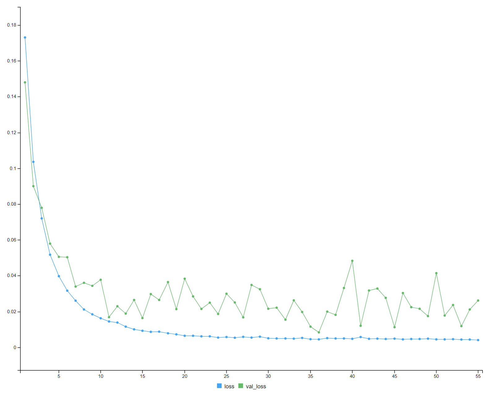

```{r, echo=FALSE, include=FALSE, eval=FALSE }
install.packages("keras")
```


```{r, include=FALSE}
library(pso)
library(ggplot2)
library(dplyr)
# library(tidyquant)
library(quantmod)
library(TTR)
library(tidyr)
library(keras)
library(tensorflow)
library(gridExtra)
```


```{r, include=FALSE, eval=FALSE}
tensorflow::install_tensorflow(version = "2.11.0", gpu = TRUE)
tf_config()
```


```{r}
prepare_stock_data = function(stock_data) {
  # Close price
  close_price <- Cl(stock_data)
  
  # Simple Moving Average (SMA) - 10-day period
  sma <- SMA(close_price, n = 10)
  
  # Exponential Moving Average (EMA) - 10-day period
  ema <- EMA(close_price, n = 10)
  
  # Relative Strength Index (RSI) - 14-day period
  rsi <- RSI(close_price, n = 14)
  
  # Moving Average Convergence Divergence (MACD) - fast = 12 days, slow = 26 days, signal = 9 days
  macd_obj <- MACD(close_price, nFast = 12, nSlow = 26, nSig = 9, maType = "EMA")
  macd_signal <- macd_obj$signal
  
  # Bollinger Bands - 20-day period
  bbands <- BBands(close_price, n = 20)
  bbands_pct <- (close_price - bbands[,1]) / (bbands[,3] - bbands[,1])
  
  # Add volume for the stock
  volume = Vo(stock_data)
  
  # Merge all the features into a single dataset
  features <- merge(close_price, sma, ema, rsi, macd_signal, bbands_pct)
  colnames(features) <- c("Close_Price", "SMA", "EMA", "RSI", "MACD_Signal", "BBands_Pct")
  
  # Remove rows with NA values
  features_complete <- na.omit(features)
  return(features_complete)
}
```


```{r}
plot_stock = function(prepped_stock_data) {
  # Convert xts object to data frame
  features_df <- data.frame(Date = index(prepped_stock_data), coredata(prepped_stock_data))
  colnames(features_df) <- c("Date", "Close_Price", "SMA", "EMA", "RSI", "MACD_Signal", "BBands_Pct")
  
  # Reshape data frame to long format
  features_long <- features_df %>%
    tidyr::gather(key = "Feature", value = "Value", -Date)
  
  # Update the scale for the "Volume" feature
  features_long$Value <- ifelse(features_long$Feature == "Volume",
                                features_long$Value / 1e6, # Adjust the scale factor as needed
                                features_long$Value)
  
  # Add a suffix to the "Volume" feature name to indicate the new scale
  features_long$Feature <- ifelse(features_long$Feature == "Volume",
                                  "Volume (Millions)",
                                  features_long$Feature)
  
  ggplot(features_long, aes(x = Date, y = Value, color = Feature, group = Feature)) +
    geom_line() +
    scale_color_discrete(name = "Features") +
    labs(title = "Stock Features over Time",
         x = "Date",
         y = "Value") +
    theme_minimal()
}
```


```{r}
train_test_split = function(stock_data) {
  # Calculate the number of rows for each set
  n_rows <- nrow(stock_data$data)
  train_size <- floor(0.70 * n_rows)
  validation_size <- floor(0.15 * n_rows)
  test_size <- n_rows - train_size - validation_size
  
  train_data <- stock_data$data[1:train_size]
  validation_data <- stock_data$data[(train_size + 1):(train_size + validation_size)]
  test_data <- stock_data$data[(train_size + validation_size + 1):n_rows]
  
  list(
    train = train_data,
    val = validation_data,
    test = test_data
  )
}
```


```{r}
normalize_data <- function(data) {
  col_mins <- apply(data, 2, min)
  col_maxs <- apply(data, 2, max)
  col_ranges <- col_maxs - col_mins
  
  normalized_data <- sweep(data, 2, col_mins, FUN = "-")
  normalized_data <- sweep(normalized_data, 2, col_ranges, FUN = "/")
  
  list(data = normalized_data, col_mins = col_mins, col_ranges = col_ranges)
}
```


```{r}
denormalize_data <- function(normalized_data, col_mins, col_ranges) {
  denormalized_data <- sweep(normalized_data, 2, col_ranges, FUN = "*")
  denormalized_data <- sweep(denormalized_data, 2, col_mins, FUN = "+")
  
  denormalized_data
}
```

```{r}
preprocess_data <- function(data, lookback_window, horizon) {
  # Normalize the data
  normalized_data <- data
  num_samples <- nrow(data) - lookback_window - horizon + 1
  x <- array(0, dim = c(num_samples, lookback_window, ncol(normalized_data)))
  y <- array(0, dim = c(num_samples, horizon))
  
  for (i in 1:num_samples) {
    x[i, , ] <- normalized_data[i:(i + lookback_window - 1), ]
    y[i, ] <- normalized_data[(i + lookback_window):(i + lookback_window + horizon - 1), "Close_Price"]
  }
  
  list(x = x, y = y)
}
```


```{r}
build_lstm_model <- function(input_shape, learning_rate, regularization) {
  model <- keras_model_sequential() %>%
    layer_lstm(units = 20, input_shape = input_shape, return_sequences=TRUE, kernel_regularizer = regularizer_l2(l = regularization)) %>%
    layer_dropout(rate=0.5) %>%
    layer_lstm(units = 10, kernel_regularizer = regularizer_l2(l = regularization)) %>%
    layer_dropout(rate=0.5) %>%
    layer_dense(units = 1)
  
  model %>% compile(
    loss = "mse",
    optimizer = optimizer_adam(learning_rate = learning_rate)
  )
  
  return(model)
}
```


```{r}
mse_fitness_function <- function(pso_params, train_data, val_data, horizon) {
  learning_rate <- pso_params[1]
  regularization <- pso_params[2]
  epochs = pso_params[3]
  lookback_window = pso_params[4]

  processed_train <- preprocess_data(train_data, lookback_window, horizon)
  processed_val <- preprocess_data(val_data, lookback_window, horizon)
  
  model <- build_lstm_model(
    input_shape = dim(processed_train$x)[-1],
    learning_rate = learning_rate,
    regularization = regularization
  )
  
  current_time <- format(Sys.time(), "%Y-%m-%d_%H-%M-%S")
  log_dir <- paste0("logs/fit/", current_time, "_lr_", learning_rate, "_reg_", regularization, "_epochs_", epochs, "_lookback_", lookback_window)
  
  # Initialize tensorboard callback with the unique log directory
  tensorboard_callback <- callback_tensorboard(log_dir = log_dir)
  
  history <- model %>% fit(
    x = processed_train$x,
    y = processed_train$y,
    validation_data = list(processed_val$x, processed_val$y),
    epochs = epochs,
    batch_size = 32,
    verbose = 0,
    callbacks=list(tensorboard_callback)
  )
  
  val_mse <- tail(history$metrics$val_loss, 1)
  return(val_mse)
}
```

```{r, fig.align='center'}
# Split the data into training, validation, and test sets

symbol <- "AMD"
start_date <- as.Date("2018-01-01")
end_date <- as.Date("2023-01-01")
stock_data <- getSymbols(symbol, src = "yahoo", from = start_date, to = end_date, auto.assign = FALSE)

prepped_stock_data = prepare_stock_data(stock_data)

plot_stock(prepped_stock_data)
normal_data_training = normalize_data(prepped_stock_data)
split_data_training = train_test_split(normal_data_training)

train_data = split_data_training$train
validation_data = split_data_training$val
test_data = split_data_training$test
```

```{r}
lower_bounds <- c(0.0001, 0.001, 10, 5)
upper_bounds <- c(0.005, 0.01, 100, 50)
initial_weights <- runif(4, min=lower_bounds, max=upper_bounds)
```


```{r eval=FALSE, echo=TRUE, message=FALSE, include=FALSE}
result <- psoptim( 
  par = initial_weights,
  fn = mse_fitness_function,
  lower = lower_bounds,
  upper = upper_bounds,
  train_data = train_data,
  val_data = validation_data,
  # lookback_window = 20,
  horizon = 1,
  control = list(maxit = 20)
)

optimal_params <- result$par
```

After running the PSO algorithm for 20 iterations, it found the below optimal parameters. We are putting them in here manually to avoid unnecessary time for re-computing the parameters by re-running the PSO process.
```{r}
optimal_params = c(0.00221, 0.00415, 55, 24) # LR, L2 regularisation, epochs, lookback window
```


```{r}
train_final_model = function(optimal_params, train_data, val_data, horizon) {
  # Extract the optimal parameters from the PSO result
  learning_rate <- optimal_params[1]
  regularization <- optimal_params[2]
  epochs = optimal_params[3]
  lookback_window = optimal_params[4]
  
  processed_train <- preprocess_data(train_data, lookback_window, horizon)
  processed_val <- preprocess_data(val_data, lookback_window, horizon)
  
  # Build the LSTM model with the optimal parameters
  model <- build_lstm_model(input_shape = dim(processed_train$x)[-1], 
                            learning_rate = learning_rate,
                            regularization = regularization)
  
  current_time <- format(Sys.time(), "%Y-%m-%d_%H-%M-%S")
  log_dir <- paste0("logs/test/", current_time, "_lr_", learning_rate, "_reg_", regularization, "_epochs_", epochs, "_lookback_", lookback_window)
  
  # Initialize tensorboard callback with the unique log directory
  tensorboard_callback <- callback_tensorboard(log_dir = log_dir)
  
  # Train the LSTM model with the optimal parameters
  history <- model %>% fit(
    processed_train$x, processed_train$y,
    epochs = epochs,
    batch_size = 32,
    validation_data = list(processed_val$x, processed_val$y),
    callbacks = list(tensorboard_callback)
  )
  return(model)
}
```


```{r, cache=TRUE, results="hide"}
train_model = train_final_model(optimal_params, train_data, validation_data, horizon=1)
```
```{r, fig.width=6, fig.height=3, fig.align='center'}

```

```{r}
evaluate_final_model = function(optimal_params, model, test_data, horizon) {
  learning_rate <- optimal_params[1]
  regularization <- optimal_params[2]
  lookback_window = optimal_params[4]

  processed_test <- preprocess_data(test_data, lookback_window, horizon)
  
  # Evaluate the performance of the LSTM model on the test data
  test_loss <- model %>% evaluate(processed_test$x, processed_test$y)
  
  # Generate predictions for the test data
  predicted_test_prices <- model %>% predict(processed_test$x)
  
  # Convert the test data and predictions to data frames
  actual_test_prices <- as.data.frame(processed_test$y)
  colnames(actual_test_prices) <- c("Actual_Price")
  predicted_test_prices <- as.data.frame(predicted_test_prices)
  colnames(predicted_test_prices) <- c("Predicted_Price")
  
  # Combine the actual and predicted test prices
  price_comparison <- cbind(actual_test_prices, predicted_test_prices)
  
  # Calculate the error between the actual and predicted test prices
  error <- mean((price_comparison$Actual_Price - price_comparison$Predicted_Price)^2)
  
  list(actual = actual_test_prices, predicted = predicted_test_prices)
}
```


```{r}
backtest_results = function(predicted, actual, normalized_data, buy_threshold = 0.05, sell_threshold = -0.05, initial_cash = 10000) {
  denormalize_data <- function(normalized_data, col_min, col_range) {
    denormalized_data <- normalized_data * col_range + col_min
    denormalized_data
  }
  
  shift_and_denormalize = function(predicted, actual) {
    # Implement your trading strategy and backtest it using the predicted_test_prices
    shifted_predicted <- predicted[-1,] # Remove the first element
    actual_trimmed <- actual[-length(actual),] # Remove the last element
    
    # This is so that instead of it being today predicted : today actual for signal, it is
    # tomorrow predicted : today actual
    
    shifted_predicted = denormalize_data(shifted_predicted, normalized_data$col_mins["Close_Price"], normalized_data$col_ranges["Close_Price"])
    actual_trimmed = denormalize_data(actual_trimmed, normalized_data$col_mins["Close_Price"], normalized_data$col_ranges["Close_Price"])
    list(predicted = shifted_predicted, actual = actual_trimmed)
  }

  shifted_and_trimmed = shift_and_denormalize(predicted, actual)
  shifted_predicted = shifted_and_trimmed$predicted
  actual_trimmed = shifted_and_trimmed$actual
  
  # Calculate the predicted profit percentage
  predicted_profit_pct <- (shifted_predicted - actual_trimmed) / actual_trimmed
  trading_signals <- ifelse(predicted_profit_pct > buy_threshold, "Buy",
                            ifelse(predicted_profit_pct < sell_threshold, "Sell", "Hold"))
  
  backtest_loop = function(predicted_profit_pct, portfolio_value, signals, actual_value) {
    cash <- portfolio_value
    num_shares <- 0
    # Initialize the cash_value vector
    cash_value <- rep(NA, length(signals))
    asset_value = rep(NA, length(signals))
    total_portfolio_value = rep(NA, length(signals))
    buy_and_hold_value = rep(NA, length(signals))
    buy_and_hold_shares = floor(cash / actual_value[1])
    
    # Backtesting loop
    for (i in 1:(length(signals) - 1)) {
      cash_value[i] <- cash
      buy_and_hold_value[i] = buy_and_hold_shares * actual_value[i]
      
      if (signals[i] == "Buy" && cash >= actual_value[i]) {
        investment_amount <- cash * predicted_profit_pct[i]
        num_shares_bought <- floor(investment_amount / actual_value[i])
        num_shares <- num_shares + num_shares_bought
        cash <- cash - (num_shares_bought * actual_value[i])
      } else if (signals[i] == "Sell" && num_shares > 0) {
        sell_amount <- num_shares * actual_value[i] * (-predicted_profit_pct[i])
        num_shares_sold <- floor(sell_amount / actual_value[i])
        num_shares <- num_shares - num_shares_sold
        cash <- cash + (num_shares_sold * actual_value[i])
      }
      
      asset_value[i] = num_shares * actual_value[i]
      total_portfolio_value[i] = cash + asset_value[i]
    }
    
    # Add the final cash value
    cash_value[length(signals)] <- cash
    asset_value[length(signals)] = num_shares * actual_value[length(actual_value)]
    total_portfolio_value[length(signals)] = cash + (num_shares * actual_value[length(actual_value)])
    buy_and_hold_value[length(signals)] = buy_and_hold_shares * actual_value[length(actual_value)]
    
    return(
      data.frame(Cash = cash_value, 
               Assets = asset_value, 
               Portfolio = total_portfolio_value, 
               BuyAndHold = buy_and_hold_value,
               Actual = actual_value,
               Signals = signals,
               Predicted = shifted_predicted)
    )
  }
  
  backtest_series = backtest_loop(predicted_profit_pct, initial_cash, trading_signals, actual_trimmed)
  return(backtest_series)
}
```

```{r, echo=F}
# The rest of the code for calculating the final portfolio value and plotting remains the same
plot_backtest = function(dates, backtest_series) {
  plot_data <- data.frame(Date = rep(dates, 6),
                          Value = c(backtest_series$Actual, backtest_series$Predicted, backtest_series$Cash, backtest_series$Assets, backtest_series$Portfolio, backtest_series$BuyAndHold),
                          Type = factor(rep(c("Actual", "Predicted", "Cash Value", "Asset Value", "Portfolio Value", "Buy and Hold Value"), each = length(dates))),
                          Signal = factor(rep(backtest_series$Signals, 6)))
  
  # Create a ggplot for the actual and predicted prices
  price_plot <- ggplot(data = subset(plot_data, Type %in% c("Actual", "Predicted")),
                       aes(x = Date, y = Value, color = Type, group = Type)) +
    geom_line() +
    geom_point(data = subset(plot_data, Type == "Actual"), aes(color = Signal), shape = 24, size = 3) +
    scale_color_manual(values = c("Actual" = "blue",
                                  "Predicted" = "orange",
                                  "Cash Value" = "black",
                                  "Portfolio Value" = "gold",
                                  "Asset Value" = "cyan3",
                                  "Buy" = "green",
                                  "Sell" = "red",
                                  "Hold" = "purple")) +
    labs(y = "Price ($)", color = "Series")
  
  # Create a ggplot for the cash value, asset value, and portfolio value
  value_plot <- ggplot(data = subset(plot_data, Type %in% c("Cash Value", "Asset Value", "Portfolio Value", "Buy and Hold Value")),
                       aes(x = Date, y = Value, color = Type, group = Type)) +
    geom_line() +
    scale_color_manual(values = c("Cash Value" = "black",
                                  "Portfolio Value" = "blue",
                                  "Asset Value" = "cyan3",
                                  "Buy and Hold Value" = "red")) +
    labs(y = "Value ($)", color = "Series")
  
  # Combine the two ggplots with a common x-axis
  combined_plot <- grid.arrange(price_plot, value_plot, ncol = 1, heights = c(1, 1))
  
  # Print the combined ggplot
  # plot(combined_plot)
}

# Calculate final portfolio value
# cat("Initial Portfolio Value:", initial_cash, "\n")
# cat("Final Portfolio Value:", backtest_series$Portfolio[nrow(backtest_series)], "\n")
# cat("Buy and Hold Final Value:", backtest_series$BuyAndHold[nrow(backtest_series)], "\n")
```


```{r, echo=F}
full_evaluation = function(optimal_params, model, test_data, normal_data, cash=100000, buy_threshold=0.02, sell_threshold=-0.02) {
  lookback_window = optimal_params[4]
  horizon = 1
  results = evaluate_final_model(optimal_params, model, test_data, horizon)
  # Combine the actual prices, predicted prices, and trading signals into one data frame
  dates <- as.Date(index(test_data)[(lookback_window + horizon + 1):(nrow(test_data))])
  
  backtest_series = backtest_results(results$predicted, results$actual, normal_data, 
                   buy_threshold, 
                   sell_threshold,
                   initial_cash = cash)
  
  
  plot_backtest(dates, backtest_series)
}
```


```{r, results="hide", fig.keep='all', fig.align='center'}
full_evaluation(optimal_params, train_model, test_data, normal_data_training)
```


```{r, echo=F}
normalize_data2 <- function(data_to_normalize, col_mins, col_ranges) {
  normalized_data <- sweep(data_to_normalize, 2, col_mins, FUN = "-")
  normalized_data <- sweep(normalized_data, 2, col_ranges, FUN = "/")
  return(normalized_data)
}
```


```{r, results="hide", fig.keep='all', fig.align='center'}
symbol <- "AMD"
start_date <- as.Date("2021-08-01")
end_date <- as.Date("2023-04-01")
stock_data_test <- getSymbols(symbol, src = "yahoo", from = start_date, to = end_date, auto.assign = FALSE)


normal_data2 = normalize_data2(prepare_stock_data(stock_data_test), normal_data_training$col_mins, normal_data_training$col_ranges)
full_evaluation(optimal_params, train_model, normal_data2, normal_data_training, cash=100000)
```

```{r, results="hide", fig.keep='all', fig.align='center'}
symbol <- "GOOGL"
start_date <- as.Date("2021-08-01")
end_date <- as.Date("2023-04-01")
stock_data_aapl <- getSymbols(symbol, src = "yahoo", from = start_date, to = end_date, auto.assign = FALSE)

normal_data_aapl = normalize_data(prepare_stock_data(stock_data_aapl))
full_evaluation(optimal_params, train_model, normal_data_aapl$data, normal_data_aapl, cash=100000, buy_threshold=0.02, sell_threshold=-0.05)
```